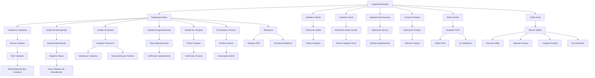

# Fluxograma do Projeto MyHair

```mermaid
graph TD
    A[Login/Autenticação] --> B[Dashboard Admin]
    B --> C[Gestão de Cadastros]
    C --> C1[Buscar Cadastro]
    C1 --> C2[Abrir Cadastro]
    C2 --> C3[Editar/Salvar/Excluir Cadastro]
    B --> D[Gestão de Manutenção]
    D --> D1[Solicitar Manutenção]
    D1 --> D2[Registrar Status]
    D2 --> D3[Gerar Relatório de Manutenção]
    B --> E[Gestão Financeira]
    E --> E1[Atualizar Financeiro]
    E1 --> E2[Vendas por Cadastro]
    E1 --> E3[Faturamento por Período]
    B --> F[Gestão de Agendamentos]
    F --> F1[Filtrar Agendamentos]
    F1 --> F2[Ver/Excluir Agendamento]
    B --> G[Gestão de Compras]
    G --> G1[Filtrar Compras]
    G1 --> G2[Ver/Excluir Compra]
    B --> H[Permissões e Acesso]
    H --> H1[Verificar Acesso]
    H1 --> H2[Autorização Admin]
    B --> I[Relatórios]
    I --> I1[Exportar PDF]
    I --> I2[Visualizar Relatórios]
    A --> J[Cadastro Cliente]
    J --> J1[Preencher Dados]
    J1 --> J2[Salvar Cadastro]
    A --> K[Cadastro Geral]
    K --> K1[Preencher Dados Gerais]
    K1 --> K2[Salvar Cadastro Geral]
    A --> L[Agendamento Serviços]
    L --> L1[Selecionar Serviço]
    L1 --> L2[Solicitar Agendamento]
    A --> M[Compra Produtos]
    M --> M1[Selecionar Produto]
    M1 --> M2[Solicitar Compra]
    A --> N[Perfil Usuário]
    N --> N1[Visualizar Perfil]
    N1 --> N2[Editar Perfil]
    N1 --> N3[Ver Relatórios]
    A --> O[Visão Geral]
    O --> O1[Buscar Salões]
    O1 --> O2[Favoritar Salão]
    O1 --> O3[Agendar Serviço]
    O1 --> O4[Comprar Produto]
    O1 --> O5[Ver Relatórios]
```

Abra este arquivo no Mermaid Live Editor ou VS Code para exportar em PDF.